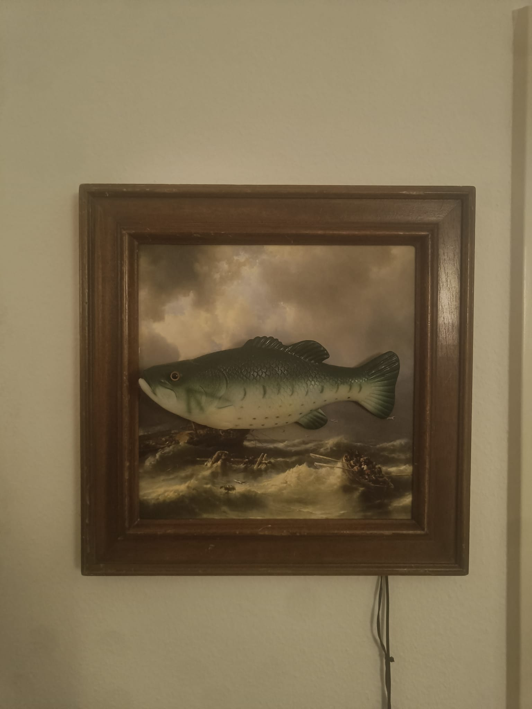
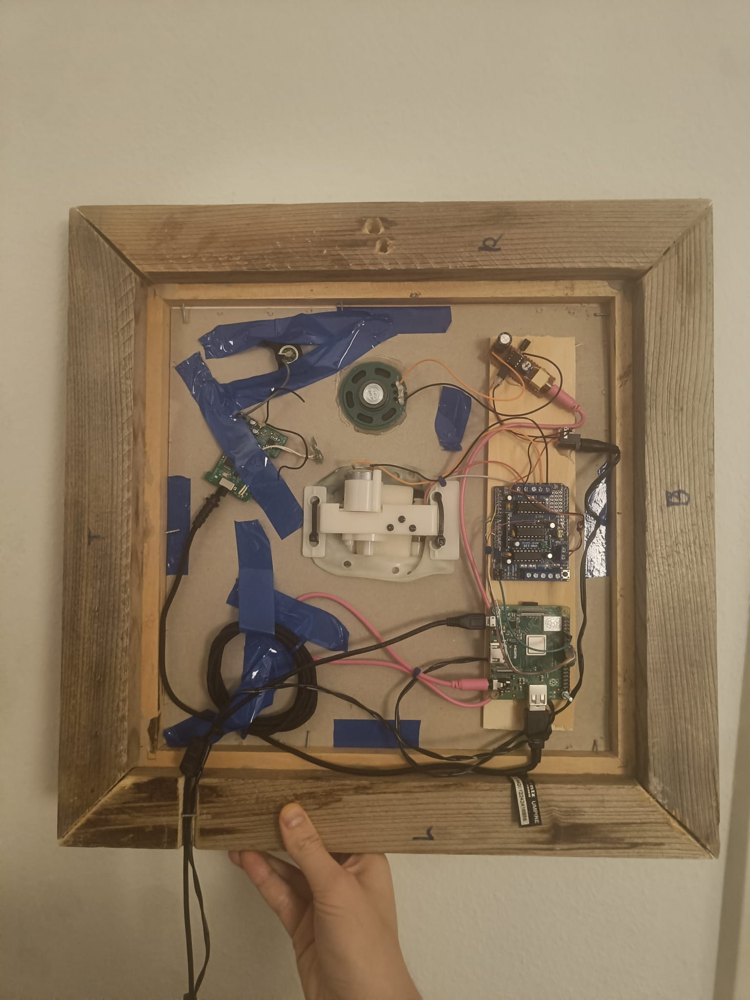

# AI fish character
In this project, I brough a cheap Big Mouth Billy Bass to life using GPT and Azure Speech services! The fish thinks its an old sea dweller and tells tales about the ol' days. Using the motors previously built into the fish, it can flap one one axis and also open its mouth to speak.

  
   

## Hardware
* Ye olde billy bass fish and its internal mechanics including 2 basic DC motors
* Raspberry PI 3 A+
* L293D motor shield (originally intented for Arduino but I hooked up cables to the PI)
* Basic LM386 amplifier to power the previously built-in speaker
* Scavenged USB-A podcast microphone
* An old picture frame from the thrift shop

## Software
* Headless Raspbian OS (includes SPI and GPIO functionality for hardware)
* Python
* Azure Speech Services
* Openai GPT-4 API

